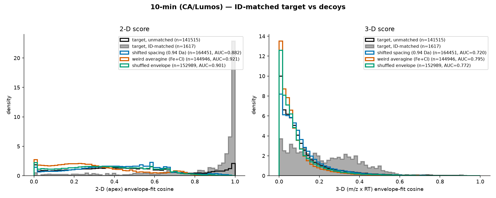
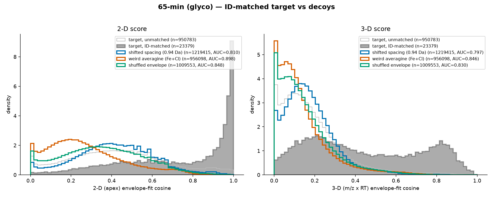
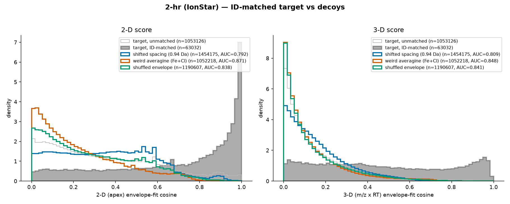
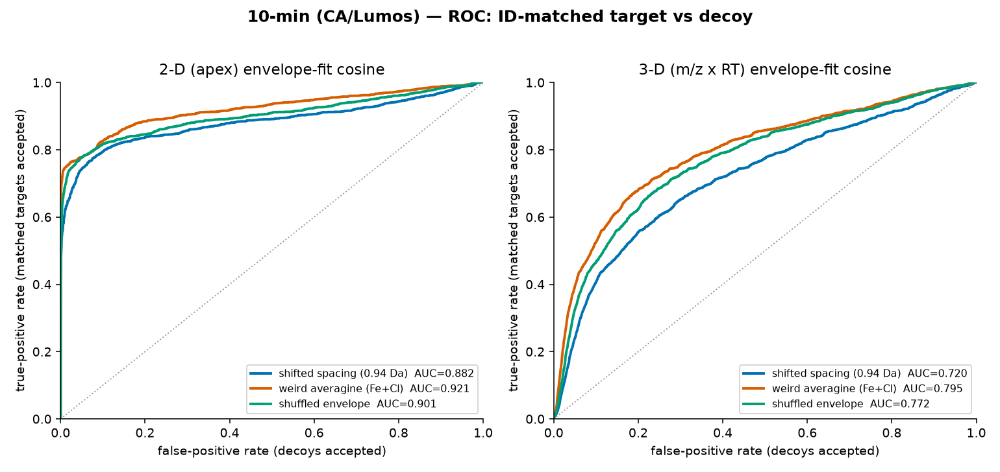
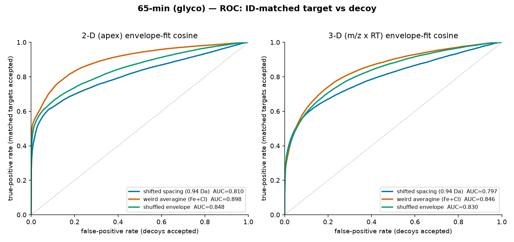
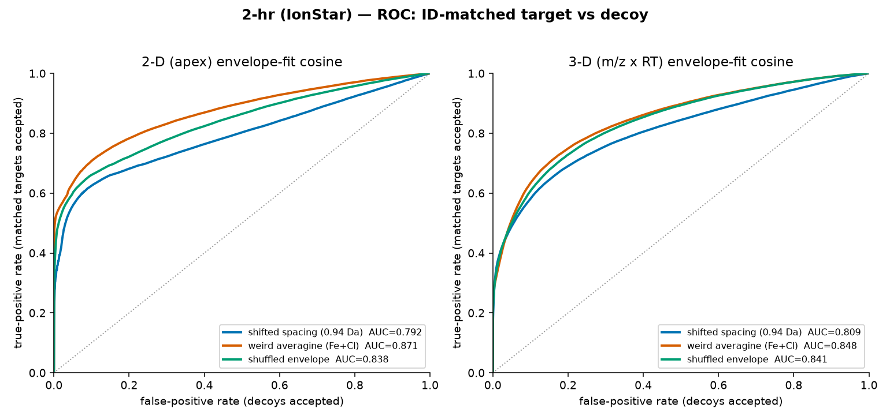
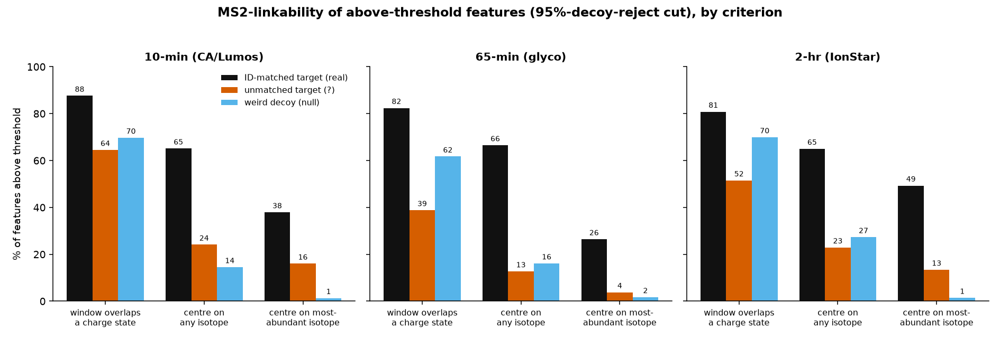

# Decoy feature detection and MS2-linkability of unmatched features

**ProteoStar untargeted MS1 feature detector — branch `decoy-features`**
14 July 2026

## 1. Purpose

Untargeted MS1 feature detection reports far more features than a database search identifies. Many of
the extra ("unmatched") features are real but unidentified; some are noise fit by chance. To
characterise that surplus we (a) built three **isotope-envelope decoys** — theoretical envelopes no
real peptide can produce — and ran the full detect→refine pipeline with each, so any feature found is
found on coincidence; (b) scored every feature with an **envelope-fit cosine** in 2-D (apex) and 3-D
(m/z × RT), and measured how well the score separates real features from decoys; and (c) asked, for the
surplus of unmatched features that survive a decoy-calibrated score cut, **how many could plausibly be
linked to a real MS2 acquisition** in the raw file.

Three benchmark files are used throughout: **10-min** (CA tryptic, Lumos), **65-min** (D. Morgen
N-glyco, HF-X), **2-hr** (IonStar spike-in). Target-feature counts and recall reproduce the
benchmarking-guide baseline exactly.

## 2. Methods

### 2.1 Decoy envelopes

Each decoy replaces the averagine isotope envelope used by the detector's matched filter, refinement,
and score, end to end:

- **shifted spacing** — isotope teeth at 0.94 Da instead of 1.00336 Da (off-lattice).
- **weird averagine** — an exotic Fe+Cl composition (`P2 C1 N1 Cl1 Fe1`) replacing the peptide
  backbone; a physically impossible tooth-weight profile.
- **shuffled envelope** — the real averagine tooth weights randomly permuted (on-lattice, wrong ratios).

### 2.2 Envelope-fit cosine score

For a feature detected with a given envelope, the score is the cosine between the predicted teeth `T`
and the observed peaks `O` on a shared m/z grid, with an unexplained-peak penalty:
`score = Σ T·O / (‖T‖·‖O‖)`. The **2-D** score uses the apex scan only; the **3-D** score extends the
template over an RT window (± 2σ, σ = 0.15 min) with `T[k,s] = w_k · g(s)`. Every feature — target or
decoy — is scored **against the same envelope it was detected with**.

### 2.3 Target/decoy matching and thresholds

A target feature is **ID-matched** if it matches a reference PSM/quantified peak within 20 ppm in mass
and the per-file RT tolerance (±0.5 / ±1.0 / ±0.5 min); otherwise it is **unmatched**. Two operating
points on the 2-D score, both calibrated on the strongest decoy (weird averagine):

- **95% recall** — threshold = 5th percentile of ID-matched target scores (keeps 95% of real IDs).
- **95% decoy rejection ("precision")** — threshold = 95th percentile of the decoy scores (only 5% of
  decoys pass). This is the cut used for the MS2-linkability analysis.

### 2.4 MS2 linkability

For every MS2 scan in the raw file we read the isolation window (target m/z and explicit lower/upper
bounds) and RT directly from the vendor file (`dump_ms2_precursors`, via `mzdata`). Isolation widths are
fixed per method (5.0, 3.4, 2.0 Th for the three files). For each above-threshold feature we build its
averagine isotope ladder at the detected charge and test three nested criteria, all requiring the MS2 to
fire **while the feature elutes or immediately after** (`RT` in `[RT start, RT end + 0.2 min]`):

1. **window overlaps a charge state** — some MS2 isolation window covers any isolable isotope m/z (≥5%);
2. **centre on any isotope** — some window is *centred* (±20 ppm) on any isotope of the feature;
3. **centre on the most-abundant isotope** — some window is centred (±20 ppm) on the feature's base
   isotope (the "bonus" criterion).

The same logic is applied to two controls: **ID-matched targets** (real, were identified — an MS2 must
exist) and **weird-averagine decoys** (fake features, real MS2 list — the coincidental-link background).

## 3. Score separates targets from decoys

All three decoys separate ID-matched targets from decoys. Figure 1 overlays the ID-matched-target score
distribution (filled) and the unmatched-target distribution (outline) against each decoy, per file.
Decoys pile up at low cosine; real features at high cosine, with unmatched features spanning both.

{width=100%}

{width=100%}

{width=100%}

### ROC and AUC

Figure 2 shows the ROC curves (positive = ID-matched target, negative = decoy). Table 1 lists the AUCs.
The **2-D** score is the stronger separator on the fast 10-min gradient; 2-D and 3-D converge, and 3-D
edges ahead, on the longer 65-min and 2-hr gradients (more RT sampling to exploit). **Weird averagine**
is the hardest decoy to reject and is used to calibrate the thresholds.

{width=100%}

{width=100%}

{width=100%}

Table: **Table 1.** ROC-AUC (ID-matched target vs decoy; 1.0 = perfect separation).

| File | shifted 2-D | shifted 3-D | weird 2-D | weird 3-D | shuffled 2-D | shuffled 3-D |
|------|:-----------:|:-----------:|:---------:|:---------:|:------------:|:------------:|
| 10-min | 0.882 | 0.720 | **0.921** | 0.795 | 0.901 | 0.772 |
| 65-min | 0.810 | 0.797 | **0.898** | 0.846 | 0.848 | 0.830 |
| 2-hr   | 0.792 | 0.809 | **0.871** | 0.848 | 0.838 | 0.841 |

## 4. Recall / precision operating points

Table: **Table 2.** Threshold at **95% recall** of ID-matched targets (weird-averagine calibration), and
how much surplus survives it. At this loose cut the score barely filters: most unmatched features and
the majority of decoys clear the bar.

| File | 2-D thr | unmatched ≥ thr / total | decoys passing |
|------|:-------:|:-----------------------:|:--------------:|
| 10-min | 0.206 | 112,953 / 141,515 (80%) | 60.4% |
| 65-min | 0.222 | 765,061 / 950,783 (80%) | 54.9% |
| 2-hr   | 0.091 | 862,525 / 1,053,126 (82%) | 69.9% |

Table: **Table 3.** Threshold that **rejects 95% of decoys** (the cut used below). This sits in the
clean upper range of the score and still retains most real features. "Real recall" = fraction of
ID-matched targets retained.

| File | 2-D thr | real recall | unmatched ≥ thr / total | decoys passing |
|------|:-------:|:-----------:|:-----------------------:|:--------------:|
| 10-min | 0.715 | 77.7% | 29,000 / 141,515 (20%) | 5.0% |
| 65-min | 0.644 | 63.4% | 179,522 / 950,783 (19%) | 5.0% |
| 2-hr   | 0.626 | 63.3% | 166,652 / 1,053,126 (16%) | 5.0% |

The 16–20% of unmatched features that survive the decoy-rejecting cut are the candidate real-but-
unidentified set examined next.

## 5. How many unmatched features are MS2-linkable?

Figure 3 and Table 4 give the three linkability criteria for the above-threshold features, with the
matched-target (real) and weird-decoy (null) controls.

{width=100%}

Table: **Table 4.** MS2-linkability of features above the 95%-decoy-reject threshold (% of each set).
Sets: *matched* = ID-matched target (real control), *unmatched* = unmatched target (the question),
*decoy* = weird-averagine decoy (coincidence null).

| File | set | n | window overlap | centre / any iso | centre / base iso |
|------|----------|---------:|:--------------:|:----------------:|:-----------------:|
| 10-min | matched | 1,257 | 87.6% | 65.1% | 37.9% |
| 10-min | unmatched | 29,000 | 64.5% | 24.1% | 16.0% |
| 10-min | decoy | 7,248 | 69.7% | 14.5% | 1.3% |
| 65-min | matched | 14,828 | 82.4% | 66.5% | 26.4% |
| 65-min | unmatched | 179,522 | 38.8% | 12.7% | 3.8% |
| 65-min | decoy | 47,805 | 61.7% | 16.1% | 1.7% |
| 2-hr | matched | 39,927 | 80.8% | 65.0% | 49.3% |
| 2-hr | unmatched | 166,652 | 51.5% | 22.9% | 13.4% |
| 2-hr | decoy | 52,615 | 69.9% | 27.3% | 1.4% |

**The loose criterion is coincidence-dominated.** "Window overlaps a charge state during elution" is
satisfied by 62–70% of the *decoys* — as often as, or more often than, the unmatched targets — because
the wide (2–5 Th) isolation windows and dense MS2 sampling cover almost any m/z that is present during a
peak's elution. This criterion therefore carries essentially no evidence of genuine targeting.

**The exact-centre criterion is the clean discriminator.** Requiring the isolation window to be
*centred* on the feature's most-abundant isotope drops the decoy background to **1.3–1.7%**, while
real ID-matched features score 26–49% and the unmatched surplus scores 3.8–16.0% — well above the null.
Subtracting the decoy coincidence background gives the number of unmatched features whose MS2 selection
cannot be explained by chance:

Table: **Table 5.** Unmatched above-threshold features plausibly linked to a genuine MS2 acquisition
(isolation centre on the base isotope, during elution), after subtracting the decoy coincidence rate.

| File | unmatched ≥ thr | centre-hit | coincidence null | **net linked** | enrichment vs null |
|------|:---------------:|:----------:|:----------------:|:--------------:|:------------------:|
| 10-min | 29,000 | 4,641 (16.0%) | 1.3% | **≈ 4,300** | 12.3× |
| 65-min | 179,522 | 6,880 (3.8%) | 1.7% | **≈ 3,800** | 2.2× |
| 2-hr | 166,652 | 22,356 (13.4%) | 1.4% | **≈ 20,100** | 9.9× |

## 6. Interpretation and caveats

- Roughly **4,300 / 3,800 / 20,100** unmatched features (10-min / 65-min / 2-hr) that clear a
  decoy-calibrated score cut were also *deliberately selected* for MS2 — the instrument centred an
  isolation window on their most-abundant isotope while they eluted — at a rate far above chance
  (12×, 2×, 10× the decoy background). These are strong candidates for real, unidentified species: they
  look like peptides by envelope shape **and** were independently deemed worth fragmenting by the
  instrument, yet no database ID was assigned (unsequenced, modified, or search-space limited).
- The unmatched surplus sits **between** the decoy null and the identified-feature control on every
  criterion — consistent with a mixture of genuine unidentified features and chance detections, not a
  single population.
- **Do not use the loose "isolation-window overlap" criterion** as evidence of reality: its coincidence
  background (the decoy null) is 60–70%, so it over-counts massively.
- **65-min undercounts.** It is a glyco dataset: the glycan shifts the isotope envelope, so a
  peptide-averagine "most-abundant isotope" is frequently the wrong tooth, and the Byonic reference RT
  is the PSM scan RT (not the chromatographic apex). Both depress the centre-hit rate for the real
  control (26% vs 38–49% elsewhere) and for the unmatched set; the true glyco number is higher than the
  ≈3,800 estimate but is not cleanly recoverable with a peptide base-peak model.
- Parameters held fixed: RT grace past elution end = 0.2 min; isolation-centre tolerance = 20 ppm;
  isolable-isotope floor = 5% relative abundance. Widening the RT grace or the ppm tolerance raises all
  three sets together and does not change the decoy-subtracted conclusion.

## 7. Reproduction

All under `analysis/decoy_features/`. Detector/scorer in `crates/flashlfq-core` (branch
`decoy-features`).

- MS2 dump: `crates/flashlfq-core/examples/dump_ms2_precursors.rs` → `ms2_{10,65,2h}.tsv`.
- Score distributions + AUC: `plot_decoys.py`; ROC curves: `roc_curves.py`.
- Thresholds: `recall_threshold.py`, `precision_threshold.py`.
- Linkability: `ms2_linkability.py` (→ `ms2_linkability.json`), `linkability_plot.py`, `net_estimate.py`.
